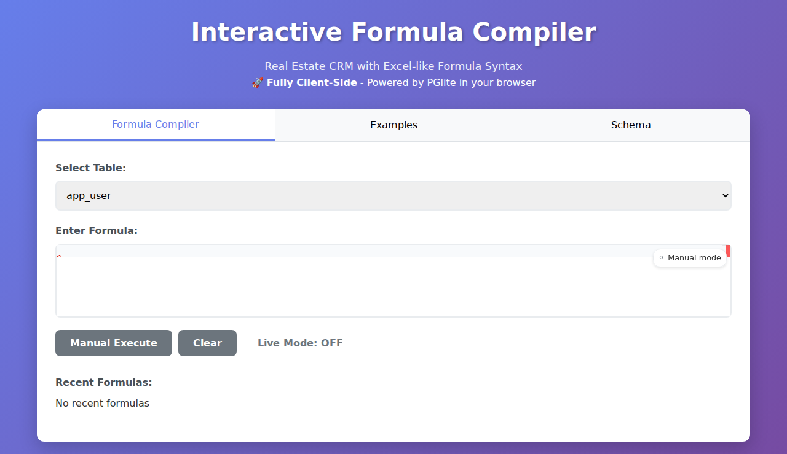
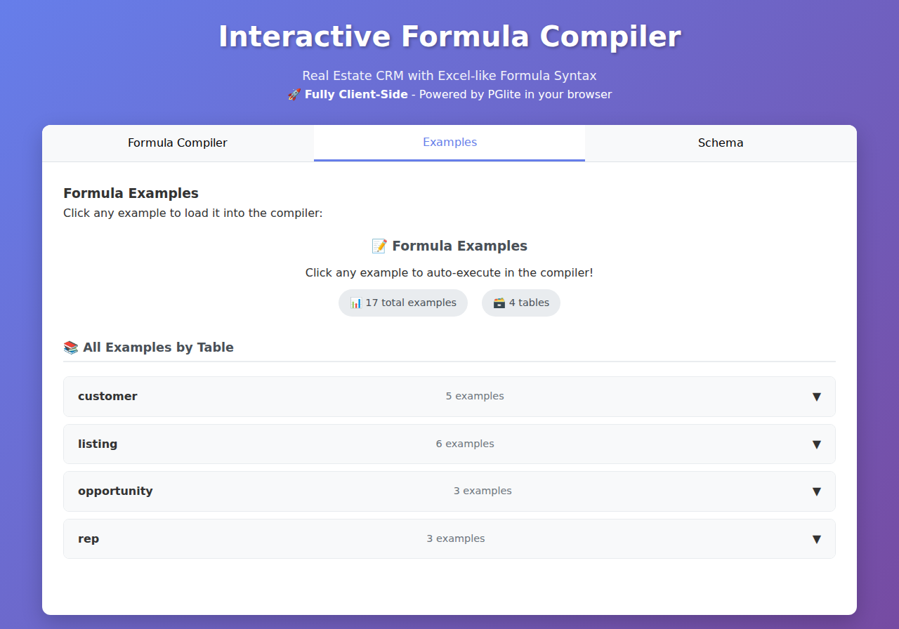

# JavaScript-to-SQL Formula Compiler

  

A JavaScript-based Excel-like formula compiler that converts formulas to PostgreSQL SQL. This project implements a complete lexer, parser, and compiler pipeline with comprehensive function support and optimized SQL generation.

## 🎯 Live Demo & Screenshots

> **🚀 [Live Demo Available](https://skamensky.github.io/postgres-formula-compiler/)** - Automatically deployed via GitHub Actions

### Formula Compiler Interface

*Interactive formula editor with live execution and autocomplete*

### Language Tooling & Autocomplete  

*Smart autocomplete with field names, relationships, and functions*

*Advanced autocomplete showing function suggestions and documentation*

### Live Execution & Error Handling

*Real-time formula execution with immediate results*

*Clear error messages with syntax highlighting*

### Schema Browser & Examples

*Interactive schema browser showing table relationships*

*Rich collection of formula examples organized by table*

*One-click example loading with full context*

## 📃 Documentation

Complete documentation available in [`docs/`](docs/):

- **[Formula Language Reference](docs/usage/README.md)** - Functions, types, operators
- **[Function Categories](docs/usage/functions/)** - Math, String, Date, Logical, Aggregate, Core, Null handling  
- **[Technical Integration](docs/lang/)** - Developer guides and metadata reference

## 🌟 Features

### Multi-Level Relationships & SQL Optimization
- **Deep Relationship Navigation**: Navigate an arbitrary number of levels deep with automatic JOIN generation. Configurable through compiler options (e.g. `customer_rel.assigned_rep_rel.user_rel.email`)
- **Intelligent SQL Optimization**: Consolidates duplicate subqueries into efficient JOINs with expression-level deduplication
- **Expression-Level Deduplication**: Detects identical SQL expressions across different formula inputs and consolidates them into single calculations
- **Performance Optimized**: Significant speed improvements through aggregate consolidation, JOIN deduplication, and smart expression reuse

### Core Compiler
- **No Dependencies**: Pure JavaScript implementation
- **Three-Stage Compilation**: Lexer → Parser → Compiler
- **Comprehensive Function Library**: 36+ functions including math, text, date, and logical operations
- **Advanced SQL Optimization**: Consolidates aggregate subqueries into efficient JOINs with expression-level deduplication
- **Relationship Support**: Handles table relationships with proper alias generation
- **Type Safety**: Validates column types and operations at compile time
- **Precise Error Reporting**: Errors include exact character positions

### Live Execution & Developer Experience ⚡

- **Live Formula Execution**: Formulas execute automatically as you type
- **Real-time Validation**: Immediate syntax error detection with visual indicators
- **Smart Autocomplete**: Field names, relationships, and functions with Tab completion
- **Intelligent Status Display**: Color-coded status indicators (🟡 Validating, 🔵 Executing, 🟢 Success, 🔴 Error)
- **Error Prevention**: Clear error messages in prominent display panels
- **Toggle Modes**: Switch between live and manual execution
- **Performance Optimized**: Smart caching and debounced execution

## 🏗️ Architecture

- **Three-Stage Pipeline**: Lexer → Parser → Compiler with intent-based intermediate representation
- **Lexer (`lexer.js`)**: Tokenizes formula strings with precise position tracking and error reporting
- **Parser (`parser.js`)**: Recursive descent parser that builds Abstract Syntax Trees with operator precedence
- **Compiler (`compiler.js`)**: Intent-based compiler generating semantic representations instead of direct SQL
- **Function System**: Metadata-driven architecture with 36+ functions across 7 categories
- **Relationship Engine (`relationship-compiler.js`)**: Multi-level relationship navigation with automatic JOIN generation
- **SQL Generator (`sql-generator.js`)**: Converts semantic intents to optimized PostgreSQL with advanced deduplication
- **Type System (`types-unified.js`)**: Symbol-based unified type system with comprehensive operation rules

## 🛠️ Tooling

- **Language Server Protocol (`lsp.js`)**: Provides IDE-like features with smart autocomplete, diagnostics, and hover documentation
- **Syntax Highlighter (`syntax-highlighter.js`)**: Token-based highlighting with semantic validation and error visualization
- **Code Formatter (`formatter.js`)**: AST-based formatter with idempotent output and configurable styling
- **Developer Tools (`developer-tools.js`)**: Unified interface combining all tooling features with schema integration

## 📄 License

MIT License

## 🤝 Contributing

This is a self-contained implementation designed to be easily readable and extensible for additional operators, functions, or SQL targets. 